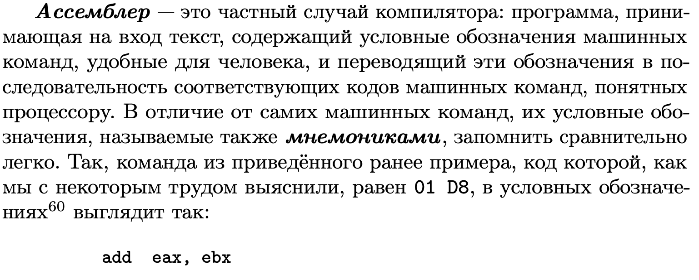

# libasm

## Research
<p>Little endian and big endian<br />
    <a href="https://agilescientific.com/blog/2017/3/31/little-endian-is-legal">
        
    </a>
</p>



[NASM Tutorial](https://cs.lmu.edu/~ray/notes/nasmtutorial/)

[x86_64 NASM Assembly Quick Reference ("Cheat Sheet")](https://www.cs.uaf.edu/2017/fall/cs301/reference/x86_64.html)

[strlen() implementation in NASM](https://tuttlem.github.io/2013/01/08/strlen-implementation-in-nasm.html)

[Difference between JE/JNE and JZ/JNZ](https://stackoverflow.com/questions/14267081/difference-between-je-jne-and-jz-jnz)

[Assembly - Conditions](https://www.tutorialspoint.com/assembly_programming/assembly_conditions.htm)

[Mac OS X 64 bit Assembly System Calls](http://dustin.schultz.io/mac-os-x-64-bit-assembly-system-calls.html)

### How to compile
```
nasm -f macho64 hello.s
ld -e start -macosx_version_min 10.13.0 -static -o hello hello.o
./hello
```

```
jmp     ; Unconditional Jump
je      ; Jump if Equal
jne     ; Jump if Not Equal
jg      ; Jump if Greater
jge     ; Jump if Greater or Equal
ja      ; Jump if Above (unsigned comparison)
jae     ; Jump if Above or Equal (unsigned comparison)
jl      ; Jump if Lesser
jle     ; Jump if Less or Equal
jb      ; Jump if Below (unsigned comparison)
jz      ; Jump if Zero
jnz     ; Jump if Not Zero
jc      ; Jump if carry set (C == 1)
jnc     ; Jump if carry is not set (C == 0)
```